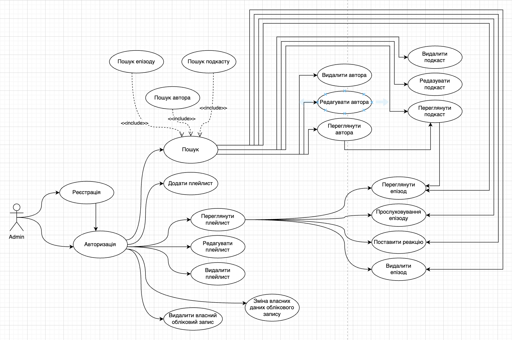

# Практична робота 1

## Завдання

Створення діаграм прецедентів, компонентів, взаємодії та класів веб

## Результати

Діаграма прецедентів:

Діаграма компонентів:

Діаграма взаємодії:

Діаграма класів:

# Практична робота 2

## Завдання

Проектування структури меню з урахуванням потреб користувача

## Результати

Структура меню:

# Практична робота 3

## Завдання

Розміщення та стилізація елементів інтерфейсу

## Результати

Інтерфейс сторінки "Головна":

Інтерфейс сторінки "Пошук за жанром":

Інтерфейс сторінки "Список плейлистів":

Інтерфейс сторінки "Вміст плейлиста":

# Практична робота 4

## Завдання

Проектування та реалізація моделей даних для збереження інформації

## Результати

Структура бази даних:

Реалізація бази даних в проєкті:

[Посилання на файл](pr4/models.py)