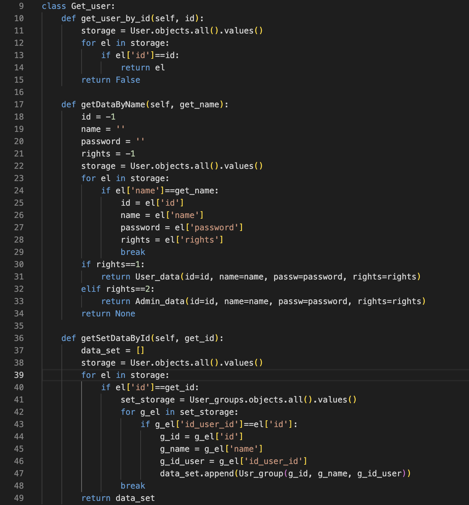
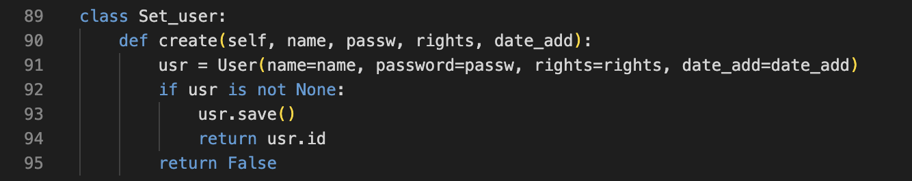
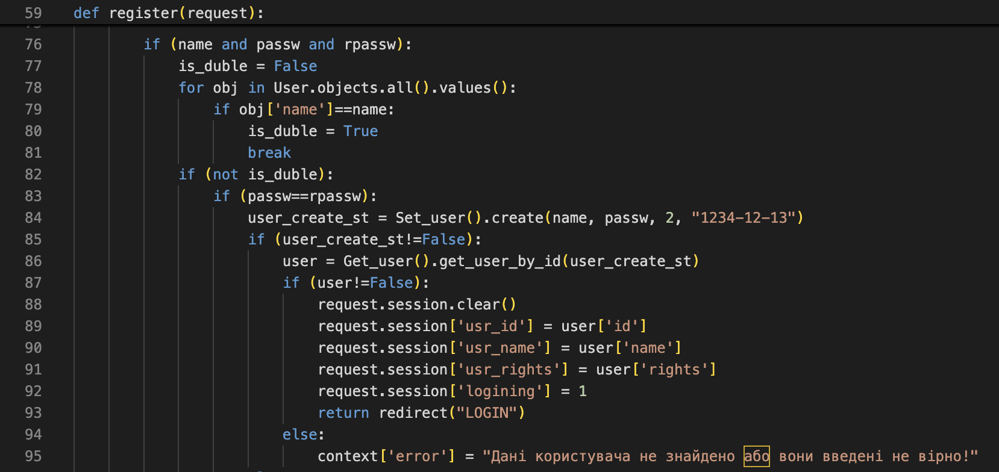
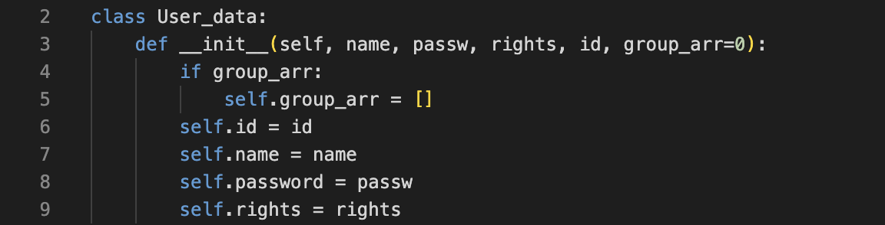
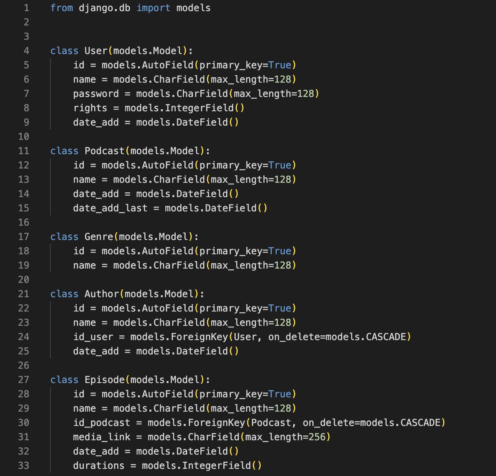
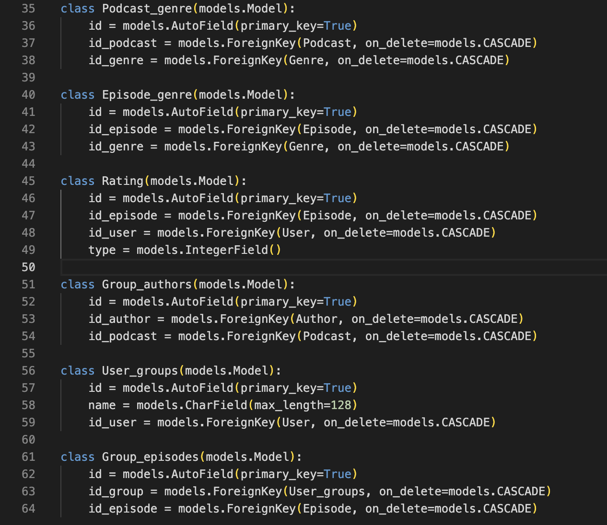

# Практична робота 5

## Завдання

Розробка механізмів отримання та оновлення даних

## Результати

Клас-інтерфейс для таблиці User:

Клас для збереження даних користувача в таблицю:

Використання класу Set_user:

Клас для збереження даних для виведення:

# Практична робота 6

## Завдання

Розробка бази даних для збереження та отримання інформації

## Результати

База даних:

# Практична робота 8

## Завдання

Створення серверної архітектури додатку

## Результати

Клас-інтерфейс для таблиці User:

Клас для збереження даних користувача в таблицю:

Використання класу Set_user:

Клас для збереження даних для виведення:

